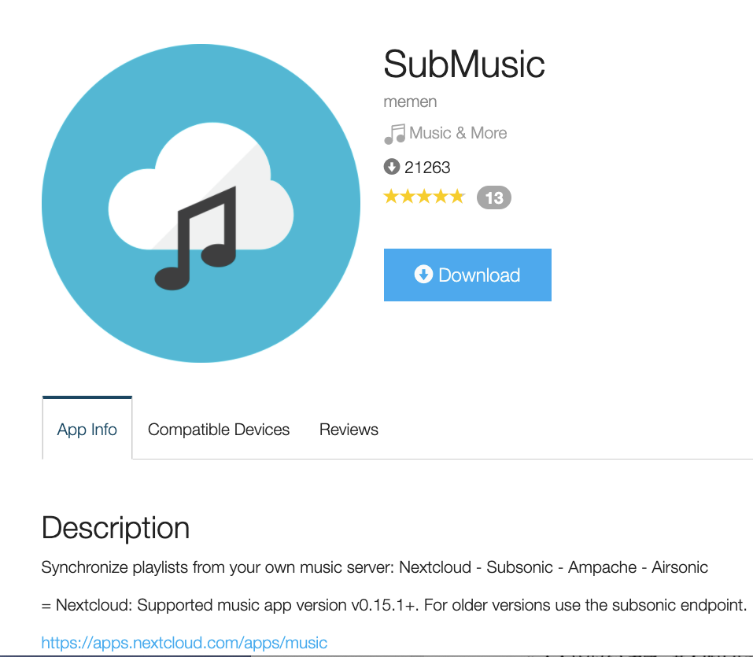

# 🎵Mp3InfoLatinization

Latinization for meta info of Mp3 with 🇨🇳Chinese characters. Mp3元信息汉字拼音化。为🇨🇳中国大陆使用港版⌚️Garmin music而作。

## Base Info

### Project Structure
- CalibrateMp3Tags.py：If the Chinese characters in meta info of these MP3s were garbled, and you know the right info
,just calibrate them with manual operations.
- InspectMp3.py: As the filename, inspect IDTags to check if they are garbled.
- requirements.txt： Requirements file `pip3 install -r requirements.txt`
- transferChineseMp3.py：Key file of this project

### What can it do？
1. Read mp3 file(s) from `src`
2. Duplicate mp3(s) to `dest` directory. If `dest` already exists，remove it and then copy file tree from `src`
3. Convert the Chinese characters to Chinese pinyin,and then write to meta info of mp3

## What for？

Use Garmin music HK version in China Mainland.I am using Garmin 245 Music 🎵

## Usage

```bash
python3 transferChineseMp3.py test_src dest
```

## Warranty
This project works well MacOs10.15.6(python3.7.6) without test on any other platforms.

## Thanks

1. [mutagen](https://github.com/quodlibet/mutagen) Mutagen is a Python module to handle audio metadata. It supports ASF,
   FLAC, MP4, Monkey's Audio, MP3, Musepack, Ogg Opus, Ogg FLAC, Ogg Speex, Ogg Theora, Ogg Vorbis, True Audio, WavPack,
   OptimFROG, and AIFF audio files.
2. [pypinyin](https://github.com/mozillazg/python-pinyin) Convert Chinese characters to pinyin

## Amazing Garmin App Gallery

1. [SubMusic](https://apps.garmin.com/en-US/apps/600bd75f-6ccf-4ca5-bc7a-0a4fcfdcf794)

   
Source code:[SubMusic Github](https://github.com/memen45/SubMusic)
